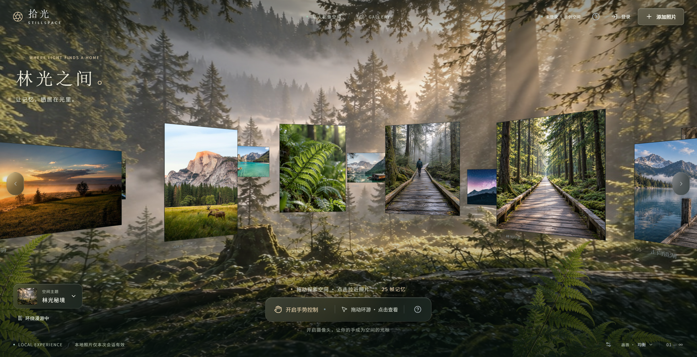

# 拾光 STILLSPACE

可运行的多用户手势 3D 粒子照片墙。第三版保留林光秘境、镜湖回廊、旷野流光三种可选自然环境，默认林光秘境；采用全屏环内视角、错落照片环、真实 HDR 环境光和玻璃控件。React + TypeScript + Vite / Three.js / MediaPipe Hand Landmarker / Express / SQLite / 阿里云私有 OSS。



## 快速运行

需要 Node.js **22.13+**（本次使用 22.20.0）与 npm。依赖使用精确版本并提交 `package-lock.json`。浏览器需 WebGL 2；摄像头需 HTTPS 或 localhost。

```sh
npm ci
npm run setup:assets
npm run dev
```

打开 **http://localhost:5188**。前端端口 5188，API 3188。使用这两个端口以避免本机其他开发项目的常见端口冲突。要修改端口，同时修改 `vite.config.ts` 的代理和 `.env` 的 `PORT` / `APP_ORIGIN`。

未登录时可查看 25 张随项目提供的影像样例（20 张摄影与 5 张生成影像）。登录后只显示当前账户的照片；新账户显示空相册，不再回退或混入示例图片。退出后恢复示例空间。

本地运行也可使用真实 OSS：在被 Git 忽略的 `.env` 中配置完整 OSS 凭证后运行 `npm run dev`，无需公网部署或将 `NODE_ENV` 改为 `production`。照片元数据保存在 SQLite，原图、展示图及缩略图持久保存在私有 OSS，刷新或重新登录后仍可加载。仅在开发时未配置 OSS 凭证，才使用会话内本地上传；生产环境缺少 OSS 配置会拒绝启动。

`setup:assets` 生成/检查缩略图，下载 Google 官方手部模型，并把匹配当前 MediaPipe 版本的 WASM 拷贝到静态目录。已有样例原图不会重复下载。首次需要网络，完成后运行时没有外部 CDN 或字体依赖。网络受限时，可在可联网机器运行该命令，将 `public/mediapipe` 复制到部署项目。

## 使用

| 操作 | 鼠标 / 触摸 / 按钮 | 手势 |
|---|---|---|
| 旋转 | 左右拖动，或两侧箭头 | 张掌停稳建立中立点；小幅左右偏移后保持，持续旋转；偏移越大越快，回中停止 |
| 查看照片 | 点击可见照片；也可点击「帧记忆」打开目录 | 只伸食指，指向任意可见照片，停留 0.7 秒打开 |
| 返回总览 | 返回按钮 / Esc | 食指指向右上方「返回照片墙」，停留 0.7 秒 |
| 完整分解 / 聚合 | 查看状态的「分解为粒子 / 聚合照片」按钮 | 同样可用常规按钮 |

旋转采用位置控制速度的虚拟摇杆：每次进入张掌模式，以当前停稳的位置为中立点，不要求手放在摄像头中心。手只需偏移一小段并保持，无需一直向同一方向移动。改为单食指时立即停止旋转，光标映射到整个屏幕；中指、无名指和小指自然弯曲即可，不必握紧，拇指位置不限。张掌浏览时不触发照片选择。

默认单手操作。比较食指与其他三指的三维关节伸展程度，支持其余手指半弯、食指轻微弯曲的自然指向；张掌确认 200 ms，食指确认 120 ms。进入与保持指向使用不同阈值，减少边界抖动；短暂手型不明确时暂停停留计时，超过 120 ms 才清除进度，不明确的帧不能确认动作。不再使用捏合、前后推拉或快速横扫触发动作。摄像头开启期间暂停自动漫游，避免指向的照片自行移动。摄像头由按钮主动开启；关闭、退出或切换账户释放轨道。模型优先在 Worker 中推理，GPU 失败用 Worker CPU，Worker 不可用时使用主线程 12 Hz CPU 兼容模式。

圆圈采用三帧中值过滤和自适应平滑，停稳时抑制细小抖动，移动时加快跟随。照片高亮与圆圈进度表示停留目标；离开目标、明显移动或切换手型会清除进度。进入照片详情时，如果光标已在返回按钮内，必须先移开再指向，避免自动返回。报告手部丢失立即停转并取消进度，重新张掌需要建立新的中立点；超过 550 ms 隐藏圆圈。参数集中在 `src/config.ts` 的 `GESTURE`，手部检测与存在阈值由 MediaPipe 执行，不使用左右手分类分数过滤有效手部。

右下角调节画质。帮助中可选择减少动态效果，并重试失败纹理；默认跟随系统减少动态偏好。右下角滑杆图标展开调试面板，显示候选、停留目标、手型、控制模式、中立点、掌部尺度、动作进度、阈值、FPS、GPU 资源数量、旋转方向坐标与原位误差。

## 多用户与配置

复制 `.env.example` 为 `.env`，仅在服务器填写实际配置。**没有任何前端 AccessKey 或 VITE_ 密钥。**

```sh
# macOS / Linux
cp .env.example .env
```

```powershell
# Windows
Copy-Item .env.example .env
```

| 变量 | 作用 |
|---|---|
| `NODE_ENV` | 生产必须为 `production` |
| `APP_ORIGIN` | 精确外部来源，不含末尾 `/`；开发默认 `http://localhost:5188`，生产必须 HTTPS |
| `PORT` | Node API / 成品静态站点端口，默认 3188 |
| `DATABASE_PATH` | SQLite 文件，默认 `./data/gallery.sqlite` |
| `OSS_REGION` | 例如 `oss-cn-hangzhou` |
| `OSS_ENDPOINT` | 可选 HTTPS 地域端点，例如 `https://oss-cn-hangzhou.aliyuncs.com`，须与地域一致 |
| `OSS_BUCKET` | 私有 Bucket 名 |
| `OSS_ACCESS_KEY_ID` / `OSS_ACCESS_KEY_SECRET` | 服务端受限 RAM 身份；可由部署平台注入 |
| `OSS_STS_TOKEN` | 可选短期 STS 身份的安全令牌；需由外部凭证机制及时轮换 |
| `REGISTRATION_INVITE_CODE` | 生产注册邀请码；空值关闭新注册 |
| `DEV_OPEN_REGISTRATION` | 仅非生产生效，默认 true；对外暴露开发服务时设 false |
| `ADMIN_USERNAME` / `ADMIN_PASSWORD_HASH` | 可选首次预建账户；没有特殊跨用户读取权限 |
| `MAX_UPLOAD_MB` | 单张源文件上限，默认 20，最大 30；解码最多 4000 万像素 |
| `MAX_PHOTOS` | 每账户照片上限，默认 120；含有效待完成上传配额 |
| `TRUST_PROXY` | 仅在恰好一个受信反向代理之后设 1 |

生成预建账户的密码摘要：

```sh
npm run password -- "replace-with-a-long-unique-password"
```

将输出的 `salt:hash` 填入 `ADMIN_PASSWORD_HASH`。首次启动创建账户，不会每次启动覆盖已有密码。生产首次启动需要预建账户或有效的注册邀请码。已有账户也可在开发阶段通过正常注册创建，再带 SQLite 数据库部署。

身份使用 scrypt 加盐密码和 7 天 HttpOnly / SameSite=Strict 会话 Cookie，生产启用 Secure。数据库仅存会话令牌摘要。变更接口检查请求 Origin 与 JSON Content-Type。注册、登录、API 均有限流。**所有照片查询、读取授权和上传完成接口都将 owner ID 与当前会话绑定**，不会接受客户端指定 owner。

多标签页通过 BroadcastChannel / storage 事件同步账户，恢复前台时再次核对会话。账户切换会清除其他标签页的旧照片、纹理与待处理上传。照片请求附带当前页面预期账户标识，服务端若发现与 Cookie 身份不一致会拒绝操作并要求刷新，避免旧页面把文件写入新账户。

## OSS 私有上传

1. 创建与 `OSS_REGION` 一致的私有 Bucket，开启阻止公共访问。
2. 配置专用 RAM 用户/角色，权限仅限这个 Bucket 的 `staging/*` 与 `photos/*`。参考 `docs/RAM-policy.example.json`，替换 Bucket 名。不要使用主账号密钥。
3. 应用仅在服务端使用凭证。上传策略、服务端 API 调用与读取 URL **全部使用 V4 签名**，适用于新建 Bucket。浏览器取得两分钟有效的、固定对象 Key / MIME / 精确字节数的 POST 授权，随后直接 POST 到 OSS，展示真实 XHR 上传进度。
4. 完成时后端检查上传记录 owner、有效期、OSS HEAD 的字节数和 MIME，再 GET 内容验证 SHA-256，使用 Sharp 实际解码。拒绝非法文件、动画和解码炸弹。
5. 校验通过才写入浏览器不能覆盖的 `photos/{userId}/{uuid}/`：原始字节 `original`、自动旋转且去除元数据的最高 3200 边长 `view.jpg`、800 边长 `thumb.jpg`。透明图默认深色底。原图保持原始字节，展示版本处理 EXIF 方向并转为正常 JPEG。
6. 成功后事务保存 objectKey、displayKey、thumbKey、宽高、大小、owner、创建时间。原始文件的尺寸若超过 3200，界面显示展示版本尺寸；比例保持不变。
7. 元数据成功后才把照片加入前端。完成接口按上传凭证幂等；即使成功响应丢失，手动重试仍复用已上传的凭证，不会再次上传并创建重复记录。未完成的过期凭证会清除，允许重新申请。发送失败释放上传配额；完成校验可重试。会话结束中止当前上传。

对象布局：

```text
staging/{userId}/{uploadId}       # 浏览器仅能写这个签名 Key
photos/{userId}/{photoId}/original
photos/{userId}/{photoId}/view.jpg
photos/{userId}/{photoId}/thumb.jpg
```

OSS 按对象 Key 的 `/` 前缀显示目录，上传时自动形成用户目录及每张照片的子目录，无需预建空文件夹。用户目录使用服务端会话中的不可变用户 ID，不使用用户名或客户端提供的目录。示例素材仍随静态站点提供，不复制到用户的 OSS 目录。

服务端校验的是实际下载的内容，并把校验后的字节写到另一个不可由浏览器写入的路径，防止签名未过期时覆盖已入库对象。缩略图与查看图去除源 EXIF；原文件仍可能包含拍摄位置等元数据，因此保持私有。

为 `staging/` 配置 **1 天后清理**的生命周期规则，以清理关闭网页或网络异常遗留对象。正常成功的 staging 对象即刻删除。少量云端写成功但进程崩溃于数据库提交前的孤立正式对象，需运维定期按 DB 引用核查，避免误删仍被引用的原图。

### CORS 与 WebGL

导入/参考 `docs/OSS-CORS.xml`。将生产域名替换为实际 `APP_ORIGIN`；仅保留实际需要的开发来源。

- AllowedOrigin：精确的 HTTPS 应用来源，以及需要时的 `http://localhost:5188`。
- AllowedMethod：POST、GET、HEAD。直传使用 POST，不需要 PUT。
- AllowedHeader：`*`；ExposeHeader：`ETag`、`x-oss-request-id`。
- 不使用公共读或 `no-cors`。图片纹理必须返回有效 `Access-Control-Allow-Origin`。
- 浏览器纹理使用 `crossOrigin=anonymous`，授权放在签名查询参数；不会向 OSS 发送应用会话 Cookie。

读接口先查归属，再签发 **15 分钟**有效的私有 URL。总览使用缩略图，查看时按屏幕请求 800–2400 像素版本。加载前检查有效期，加载失败重新申请一次 URL；高清失败保留缩略图。已解码的纹理不因 URL 过期突然消失。退出后已签出的 URL 仍可能在剩余有效期内使用，这属于短时签名 URL 的边界；不要将签名链接发布到日志或公共页面。

## 构建与部署

```sh
npm run check
npm test
npm run build
npm start
```

`build` 输出 `dist/`（前端、样例和模型）与 `dist-server/index.js`。`start` 用 Node 同时提供前端与 API，不需要 Vite 生产服务器。部署前设置 `.env` 中 `NODE_ENV=production`、HTTPS `APP_ORIGIN`、正式凭证与注册策略，然后通过 Nginx/Caddy 提供 TLS。Nginx 反向代理片段见 `deploy/nginx.conf.example`。

Node 进程仅需接收小 JSON；图片不通过反代上传。`data/` 必须挂载持久卷并备份。SQLite WAL 适合本项目的单实例部署；不要在多个 Node 副本间直接共享 SQLite 文件。横向扩容时需迁移 PostgreSQL 和共享会话/限流设施。

Docker：

```sh
docker build -t stillspace .
docker run -d --name stillspace --restart unless-stopped \
  --env-file .env -p 127.0.0.1:3188:3188 \
  -v stillspace-data:/app/data stillspace
```

Docker 镜像构建时获取公开模型，不包含 `.env` 或凭证；正式配置在运行时注入。须在前面部署 HTTPS 反代。未在当前环境实际执行 Docker 或公网部署。

## 模块目录

```text
src/
  scene/GalleryScene.ts       Three.js 相机、圆柱布局、选取、可逆动画和生命周期
  scene/particles.ts          照片平面 + 纹理 UV 采样粒子的 Shader
  resources/photos.ts        缩略图/高清加载、签名刷新、纹理释放
  gesture/recognizer.ts       手型切换、摇杆校准、全屏指向、停留确认
  gesture/hand.worker.ts      MediaPipe Worker（使用 ES module WASM）
  gesture/camera.ts           用户授权、推理调度、CPU 降级、轨道释放
  interaction/machine.ts     主状态与粒子子状态
  upload/client.ts           解码、Object URL、受限直传、进度、校验重试
  ui/App.tsx                 中文界面、登录、帮助、上传和照片目录
  ui/styles.css              暗色影像展厅 / 响应式布局
  config.ts                  画质、粒子预算、动画时长、手势阈值
server/
  app.ts                     API / 所有权校验 / 实际上传验证
  auth.ts                    scrypt、会话摘要、常量时间校验
  storage.ts                 OSS 授权与存储适配器
  db.ts                      SQLite 表结构与索引
  config.ts                  环境变量验证
  index.ts                   HTTP 启动与优雅关闭
shared/types.ts              照片 / 状态 / 画质类型
public/samples/              25 张原图、缩略图、来源清单
scripts/                    样例模型准备、密码摘要、浏览器实测
tests/                      状态机、时间序列、身份隔离、上传和持久化验证
docs/                       OSS 配置、验收报告、真实截图
```

`.gitignore` 已排除密钥、SQLite/用户数据、依赖、构建产物、日志和可再生模型。示例照片、源码、锁文件、配置模板和截图可提交 Git。

## 调参和实现边界

`src/config.ts`：

| 参数 | 默认 |
|---|---|
| `QUALITY.low` | DPR ≤ 1，最多 5,500 粒子，160 背景点 |
| `QUALITY.medium` | DPR ≤ 1.5，最多 14,000 粒子，320 背景点 |
| `QUALITY.high` | DPR ≤ 2，最多 28,000 粒子，520 背景点 |
| `MOTION.travelMs` | 拉近 / 返回 1,200 ms |
| `MOTION.dissolveMs` | 独立分解 / 聚合 850 ms |
| `MOTION.entryMs` | 入场 1,100 ms |
| `MOTION.maxSpeed` / `damping` | 0.72 rad/s / 5.5 |
| `MOTION.idleSpeed` / `idleDelayMs` | 自动漫游 0.026 rad/s；操作后等待 5,500 ms |
| `SPACE.innerRadius` / `outerRadius` | 两圈半径 11.2 / 14.2 |
| `SPACE.cameraZ` / `desktopFov` / `mobileFov` | 环内 Z = 5.2；桌面 60°，手机 76° |
| `SPACE.parallax` / `floorY` | 轻微视差 0.16；地面 Y = −6.6 |
| `GESTURE.dwellMs` / `dwellRadius` | 停留 700 ms；光标偏离锚点超过归一化距离 0.03 则重新计时 |
| `poseHoldMs` / `centerHoldMs` | 手型确认 200 ms；中立点停稳 320 ms |
| `pointHoldMs` / `pointGraceMs` | 食指确认 120 ms；手型短暂不明确容错 120 ms，暂停计时 |
| `joystickDeadzone` / `joystickRange` | 水平中立死区 0.025；偏移 0.15 达到最高速度，靠近边缘时缩短范围 |
| `rotationMaxSpeed` | 手势上限 3.2 rad/s；减少动态模式上限 1.2 rad/s |
| `rotationResponseMs` / `rotationTimeoutMs` | 80 ms 平滑响应；240 ms 没有新旋转输入则减速停止 |
| `lossGraceMs` / `lossCancelMs` | 帧间隔超过 230 ms 重新确认；丢失超过 550 ms 隐藏光标 |

实际粒子数还按照片投影面积缩放；高密度粒子最多用于一个交互目标和一个串行入场目标。Shader 保存固定平面位置、UV、随机种子、扩散目标，GPU 驱动全部点位。稳定 UV 网格互补移交让一个采样单元属于照片平面或粒子，避免加法叠加亮度；完整分解时照片平面所有片元均丢弃，聚合后销毁粒子几何并恢复高清纹理。移动使用连续插值，返回恢复本地位置/四元数/尺寸。

布局采用朝内的错落环带：相机 Z 为 5.2，处于照片环内；近/远基准半径 11.2 / 18.2，径向偏移 ±1.35，角度错开半列，高度有稳定偏移。初次载入按数量设置每带 5–16 列；25 张默认影像全部分布在首对环带。追加上传不重排已有照片，较大收藏继续使用独立竖向层。点击「帧记忆」可从目录访问任何照片。每个账户最多 120 张；不为总览同时加载全部高清纹理。

照片不受灯光和 tone mapping 染色，采用 sRGB 纹理和输出。背景调暗在显示色彩转换前完成。当前版使用全屏环内透视、地面消隐与弧形接缝、顶部环形灯槽、前景微尘和极轻的指针视差营造空间。展厅环境保持静止，照片环绕观众旋转；玻璃控制条使用真实 backdrop blur、半透明叠层和细高光边缘。**没有启用屏幕空间景深或泛光后处理**；这是避免照片模糊/过曝与额外 GPU 开销的取舍。它不提供真实深度传感器级推拉精度。

每帧渲染使用类内高频状态；React 只接受低频摘要与离散事件。照片解码/上传前端串行，缩略图加载最多 2 个并发，服务端解码最多 2 个并发。高清返回后释放；粒子聚合后销毁；退出清空纹理、几何和 Object URL。页面隐藏停止渲染、暂停推理，恢复后继续剩余动画；WebGL 上下文恢复也使用同一暂停时钟。摄像头初始化可取消，旧请求不会重新启动已关闭的会话。较弱设备可使用流畅模式。

## 验证

```sh
npm test
npm run check
npm run build
npm audit

# 保持 npm run dev 运行；默认使用已安装的 Microsoft Edge
npm run test:browser
npm run test:camera
npm run test:lifecycle
npm run test:session
npm run test:samples
npm run test:resilience
npm run test:touch
npm run test:space
```

也可设置 `BROWSER_CHANNEL=chrome` 使用已安装 Chrome；脚本使用 Playwright，不依赖用户现有浏览器标签页。`TEST_URL` 可覆盖验证地址。测试会在开发数据库中注册 `qa_*` 测试账户，不能对真实生产站直接运行。

`test:samples` 须先运行 `npm run build`；它启动独立临时服务并使用内存数据库，验证未登录示例、登录后空相册、刷新和跨标签页账户切换，不创建真实用户或上传 OSS 文件。其他上传类浏览器测试会按当前存储模式执行；配置了 OSS 时会实际上传。

详细已验证与未验证清单见 [docs/VALIDATION.md](docs/VALIDATION.md)，机器可读结果见 [docs/browser-qa.json](docs/browser-qa.json) 与 [docs/camera-qa.json](docs/camera-qa.json)。真实摄像头动态手势、真实 OSS、长时间内存、移动设备和生产部署仍需按清单实测，不能用模拟关键点或测试存储替身代替这些结论。

## 依据的官方文档

2026-09-12 通过 Context7 获取 Three.js、MediaPipe、ali-oss、Vite 文档，再核对已安装包的公开类型与 npm 版本。MediaPipe module Worker 明确使用 `FilesetResolver.forVisionTasks(path, true)`，兼容模式使用非 module WASM。

- [Vite 入门与 Node 要求](https://vite.dev/guide/)
- [Three.js 色彩管理](https://threejs.org/manual/en/color-management.html)
- [Three.js 资源清理](https://threejs.org/manual/en/cleanup.html)
- [MediaPipe Web Hand Landmarker](https://developers.google.com/edge/mediapipe/solutions/vision/hand_landmarker/web_js)
- [ali-oss 官方 SDK](https://github.com/ali-sdk/ali-oss)
- [OSS V4 迁移与 V1 下线说明](https://help.aliyun.com/zh/oss/developer-reference/guidelines-for-upgrading-v1-signatures-to-v4-signatures)
- [示例图像授权](https://unsplash.com/license)

### 第三版：三种自然空间

通过左下「空间主题」切换林光秘境、镜湖回廊、旷野流光；手机上入口位于标题下方。首次访问默认森林，选择记在本浏览器 `stillspace:theme`，无存储权限或未知值回退森林。不写入用户账户资料，不改变多用户照片权限。切换时共用同一批照片、旋转位置与状态机，不重新创建摄像头或渲染循环。

- `src/scene/themes.ts`：主题名称、文案、HDR 强度与默认值。
- `src/scene/naturalEnvironment.ts`：远处曲面全景、真实 HDR/PMREM、近处透明植物/湖岸 Sprite、850ms 环境渐变。仅保留当前与过渡中的上一套资源；异步过期结果立即释放。背景图失败保留当前环境，HDR/前景失败降级并提供重试；图形上下文恢复后重新生成 HDR 环境光。
- `src/scene/layout.ts`：错落半径、高度、照片比例与稳定原位。
- `src/scene/environment.ts`：共用照片标题纹理图集。
- `src/ui/nature.css`：三种色调、玻璃控件、主题选择器、手机布局；`space.css` / `styles.css` 保留基础布局、认证与上传组件。
- `src/config.ts`：`idleSpeed = 0.075 rad/s`（原版 0.026，约 2.9 倍，一圈约84秒），手动操作后1800ms恢复。拉近/返回仍1200ms；返回完成当帧重置等待计时，下一渲染帧即可继续环绕。手动暂停及减少动态偏好优先。粒子密度、DPR、动画时长也在此文件。

全景 JPG 是为参考图制作的 1774×887 **LDR 视觉素材**，投射到远处曲面；不是假称 HDR 的升亮图片。照明另外加载 Poly Haven CC0 的1K Radiance `.hdr`，由 PMREM 生成环境光，作用于 PBR 薄片侧边。照片用原色纹理 Shader，不受环境曝光或色调映射染色。光束和雾的主体来自全景摄影表现，前景 Sprite 和尘埃独立处于3D空间；本版没有昂贵的实时体积光积分或可自由行走的完整森林模型。

所有运行素材均随项目或 setup 脚本提供。HDR 下载地址与校验码在 `scripts/setup-environments.mjs`，许可和生成资产说明见 [ASSETS](docs/ASSETS.md)。构建/部署命令及 OSS 配置沿用上文；无需新增密钥。

最新验证、实际截图、限制见 [第三版验证记录](docs/VALIDATION-V3.md) 与 [设计检查](design-qa.md)。原有 `docs/VALIDATION.md` 记录第一、二版历史验证，不代表第三版再次逐项实测。
